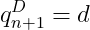
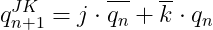

# Lab 7: Latches and Flip-flops

## Preparation tasks 

### Characteristic equations and completed tables for D, JK, T flip-flops.

   | **clk** | **d** | **q(n)** | **q(n+1)** | **Comments** |
   | :-: | :-: | :-: | :-: | :-- |
   |  | 0 | 0 | 0 | Sampled and stored |
   |  | 0 | 1 | 0 | Sampled and stored |
   |  | 1 | 0 | 1 | Sampled and stored |
   |  | 1 | 1 | 1 | Sampled and stored |

   | **clk** | **j** | **k** | **q(n)** | **q(n+1)** | **Comments** |
   | :-: | :-: | :-: | :-: | :-: | :-- |
   |  | 0 | 0 | 0 | 0 | No change |
   |  | 0 | 0 | 1 | 1 | No change |
   |  | 0 | 0 | 1 | 0 | Reset     |
   |  | 0 | 1 | 1 | 0 | Reset     |
   |  | 1 | 0 | 0 | 1 | Set       |
   |  | 1 | 0 | 1 | 1 | Set       |
   |  | 1 | 1 | 0 | 1 | Toggle    |
   |  | 1 | 1 | 1 | 0 | Toggle    |

   | **clk** | **t** | **q(n)** | **q(n+1)** | **Comments** |
   | :-: | :-: | :-: | :-: | :-- |
   |  | 0 | 0 | 0 | No change       |
   |  | 0 | 1 | 1 | No change  	    |
   |  | 1 | 0 | 1 | Invert (Toggle) |
   |  | 1 | 1 | 0 | Invert (Toggle) |

## D latch
### VHDL code listing of the process `p_d_latch` 
### VHDL reset and stimulus processes from the testbench `tb_d_latch.vhd` 
### Screenshot with simulated time waveforms

## Flip-flops
### VHDL code listing of the processes `p_d_ff_arst`, `p_d_ff_rst`, `p_jk_ff_rst`, `p_t_ff_rst` with syntax highlighting
### Listing of VHDL clock, reset and stimulus processes 
### Screenshot with simulated time waveforms

## Shift register
### Image of the shift register schematic.

