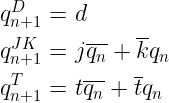

# Lab 7: Latches and Flip-flops

## Preparation tasks 

### Characteristic equations and completed tables for D, JK, T flip-flops.

   | **clk** | **d** | **q(n)** | **q(n+1)** | **Comments** |
   | :-: | :-: | :-: | :-: | :-- |
   |  | 0 | 0 | 0 | No change |
   |  | 0 | 1 | 0 | RESET     |
   |  | 1 | 0 | 1 | No change |
   |  | 1 | 1 | 1 | SET       |

   | **clk** | **j** | **k** | **q(n)** | **q(n+1)** | **Comments** |
   | :-: | :-: | :-: | :-: | :-: | :-- |
   |  | 0 | 0 | 0 | 0 | No change |
   |  | 0 | 0 | 1 | 1 | No change |
   |  | 0 | 0 | 1 | 0 | RESET     |
   |  | 0 | 1 | 1 | 0 | RESET     |
   |  | 1 | 0 | 0 | 1 | SET       |
   |  | 1 | 0 | 1 | 1 | SET       |
   |  | 1 | 1 | 0 | 1 | Toggle    |
   |  | 1 | 1 | 1 | 0 | Toggle    |

   | **clk** | **t** | **q(n)** | **q(n+1)** | **Comments** |
   | :-: | :-: | :-: | :-: | :-- |
   |  | 0 | 0 | 0 | No change       |
   |  | 0 | 1 | 1 | No change  	    |
   |  | 1 | 0 | 1 | Invert (Toggle) |
   |  | 1 | 1 | 0 | Invert (Toggle) |

## D latch
### VHDL code listing of the process `p_d_latch` with syntax highlighting,
### Listing of VHDL reset and stimulus processes from the testbench `tb_d_latch.vhd` file with syntax highlighting and asserts,
### Screenshot with simulated time waveforms; always display all inputs and outputs. The full functionality of the entity must be verified.

## Flip-flops
### VHDL code listing of the processes `p_d_ff_arst`, `p_d_ff_rst`, `p_jk_ff_rst`, `p_t_ff_rst` with syntax highlighting,
### Listing of VHDL clock, reset and stimulus processes from the testbench files with syntax highlighting and asserts,
### Screenshot with simulated time waveforms; always display all inputs and outputs. The full functionality of the entities must be verified.

## Shift register
### Image of the shift register schematic. The image can be drawn on a computer or by hand. Name all inputs, outputs, components and internal signals.

