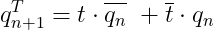

# Lab 7: Latches and Flip-flops

## Preparation tasks 

### Characteristic equations and completed tables for D, JK, T flip-flops.


   | **clk** | **d** | **q(n)** | **q(n+1)** | **Comments** |
   | :-: | :-: | :-: | :-: | :-- |
   |  | 0 | 0 | 0 | Sampled and stored |
   |  | 0 | 1 | 0 | Sampled and stored |
   |  | 1 | 0 | 1 | Sampled and stored |
   |  | 1 | 1 | 1 | Sampled and stored |


   | **clk** | **j** | **k** | **q(n)** | **q(n+1)** | **Comments** |
   | :-: | :-: | :-: | :-: | :-: | :-- |
   |  | 0 | 0 | 0 | 0 | No change |
   |  | 0 | 0 | 1 | 1 | No change |
   |  | 0 | 0 | 1 | 0 | Reset     |
   |  | 0 | 1 | 1 | 0 | Reset     |
   |  | 1 | 0 | 0 | 1 | Set       |
   |  | 1 | 0 | 1 | 1 | Set       |
   |  | 1 | 1 | 0 | 1 | Toggle    |
   |  | 1 | 1 | 1 | 0 | Toggle    |


   | **clk** | **t** | **q(n)** | **q(n+1)** | **Comments** |
   | :-: | :-: | :-: | :-: | :-- |
   |  | 0 | 0 | 0 | No change       |
   |  | 0 | 1 | 1 | No change  	    |
   |  | 1 | 0 | 1 | Invert (Toggle) |
   |  | 1 | 1 | 0 | Invert (Toggle) |

## D latch
### VHDL code listing of the process `p_d_latch` 
```vhdl
p_d_latch : process (d, arst, en)
    begin
        if (arst = '1' ) then
            q     <= '0';
            q_bar <= '1';
        elsif (en = '1')then
            q     <= d;
            q_bar <= not d;
        end if;
    end process p_d_latch;
```
### VHDL reset and stimulus processes from the testbench `tb_d_latch.vhd` 
```vhdl
   p_reset_gen : process
    begin

        s_arst <= '0';
        wait for 50 ns;

        s_arst <= '1';
        wait for 60 ns;
        assert(s_q = '0' and s_q_bar = '1')
        report "Test failed for reset value 1" severity error;

        s_arst <= '0';
        wait for 100 ns;
        assert(s_q = '1' and s_q_bar = '0')
        report "Test failed for reset value 0" severity error;

        s_arst <= '1';
        wait for 53 ns;
        assert(s_q = '0' and s_q_bar = '1')
        report "Test failed for reset value 1" severity error;

        s_arst <= '0';
        wait for 74 ns;
        assert(s_q = s_d and s_q_bar = (not s_d))
        report "Test failed for reset value 0" severity error;

        s_arst <= '1';
        wait for 53 ns;
        assert(s_q = '0' and s_q_bar = '1')
        report "Test failed for reset value 1" severity error;

        s_arst <= '0';
        wait for 300 ns;
        assert(s_q = s_d and s_q_bar = (not s_d))
        report "Test failed for reset value 0" severity error;

        s_arst <= '1';
        wait for 53 ns;
        assert(s_q = '0' and s_q_bar = '1')
        report "Test failed for reset value 1" severity error;

        s_arst <= '0';
        wait;

    end process p_reset_gen;

    p_stimulus : process
    begin
        report "Stimulus process started" severity note;

        s_d  <= '0';
        s_en <= '0';

        --d sekv
        wait for 25 ns;
        s_d <= '1';
        wait for 25 ns;
        s_d <= '0';
        wait for 25 ns;
        s_d <= '1';
        wait for 25 ns;
        s_d <= '0';
        assert(s_arst = '1' and s_en = '0' and s_d = '1' and s_q = '0' and s_q_bar = '1')
        report "Test failed for first set (arst=1, en=0, d=1, q=0)" severity error;

        s_en <= '1';

        --d sekv
        wait for 25 ns;
        s_d <= '1';
        wait for 25 ns;
        s_d <= '0';
        wait for 25 ns;
        s_d <= '1';
        wait for 25 ns;
        s_d <= '0';
        assert(s_arst = '0' and s_en = '1' and s_d = '1' and s_q = '1' and s_q_bar = '0')
        report "Test failed for second set (arst=0, en=1, d=1, q=1)" severity error;

        s_en <= '0';

        --d sekv
        wait for 25 ns;
        s_d <= '1';
        wait for 25 ns;
        s_d <= '0';
        wait for 25 ns;
        s_d <= '1';
        wait for 25 ns;
        s_d <= '0';
        assert(s_arst = '0' and s_en = '0' and s_d = '1' and s_q = '0' and s_q_bar = '1')
        report "Test failed for third set (arst=0, en=0, d=1, q=0)" severity error;

        s_en <= '1';

        --d sekv
        wait for 25 ns;
        s_d <= '1';
        wait for 25 ns;
        s_d <= '0';
        wait for 25 ns;
        s_d <= '1';
        wait for 25 ns;
        s_d <= '0';
        assert(s_arst = '0' and s_en = '1' and s_d = '1' and s_q = '1' and s_q_bar = '0')
        report "Test failed for fourth set (arst=0, en=1, d=1, q=1)" severity error;

         --d sekv
        wait for 25 ns;
        s_d <= '1';
        wait for 25 ns;
        s_d <= '0';
        wait for 25 ns;
        s_d <= '1';
        wait for 25 ns;
        s_d <= '0';
        assert(s_q = '1' and s_q_bar = '0')
        report "Test failed for fifth set" severity error;

        s_en <= '0';

        wait for 100 ns;

        s_en <= '1';

         --d sekv
        wait for 25 ns;
        s_d <= '1';
        wait for 25 ns;
        s_d <= '0';
        wait for 25 ns;
        s_d <= '1';
        wait for 25 ns;
        s_d <= '0';
        assert(s_arst = '1' and s_en = '1' and s_d = '1' and s_q = '0' and s_q_bar = '1')
        report "Test failed for sixth set (arst=1, en=1, d=1, q=0)" severity error;

        report "Stimulus process finished" severity note;
        wait;
    end process p_stimulus;
```
### Screenshot with simulated time waveforms

## Flip-flops

### VHDL code listing of the processes:

#### p_d_ff_arst
```vhdl

architecture Behavioral of d_ff_arst is

begin

p_d_ff_arst : process (clk, arst)
    begin
        if (arst = '1' ) then
            q     <= '0';
            q_bar <= '1';
        elsif rising_edge (clk)then
            q     <= d;
            q_bar <= not d; 
        end if;
    end process p_d_ff_arst;
end Behavioral;
```

#### p_d_ff_rst
```vhdl

  p_d_ff_rst : process (clk)
  begin
      if rising_edge(clk) then
          if(rst = '1') then
              q     <= '0';
              q_bar <= '1';
          else
              q     <= d;
              q_bar <= not d;
          end if;    
      end if;
  end process p_d_ff_rst;

```

#### p_jk_ff_rst

```vhdl
architecture Behavioral of jk_ff_rst is
    signal s_q : std_logic;
begin
    p_jk_ff_rst : process (clk)
    begin
        if rising_edge(clk) then
            if (rst = '1') then
                s_q <= '0';
            else
                if (j = '0' and k = '0') then
                    s_q <= s_q;
                    
                elsif (j = '0' and k = '1') then
                    s_q <= '0';
                    
                elsif (j = '1' and k = '0') then
                    s_q <= '1';
                    
                elsif (j = '1' and k = '1') then
                    s_q <= not s_q;
                
                end if;
            end if;
        end if;
    end process p_jk_ff_rst;

    q       <= s_q;
    q_bar   <= not s_q;
    
end Behavioral;

```

#### p_t_ff_rst
```vhdl

p_t_ff_rst : process (clk)
begin
    if rising_edge(clk) then
        if (rst = '1') then
            s_q     <= '0';
            s_q_bar <= '1';
        elsif (t = '0') then
            s_q     <= s_q;
            s_q_bar <= s_q_bar;
        else
            s_q     <= not s_q;
            s_q_bar <= not s_q_bar;
        end if;
    end if;    
end process p_t_ff_rst;

q     <= s_q;
q_bar <= s_q_bar;

```
### Listing of VHDL clock, reset and stimulus processes 
### Screenshot with simulated time waveforms

## Shift register
### Image of the shift register schematic.

