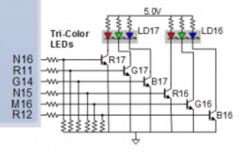
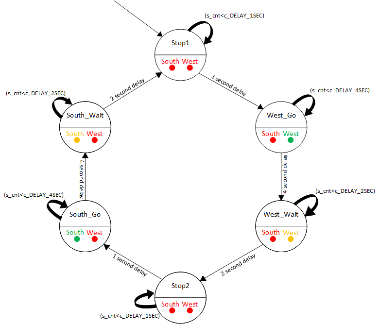
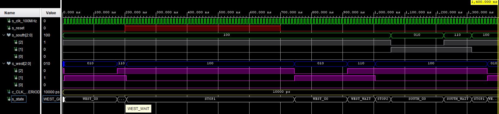
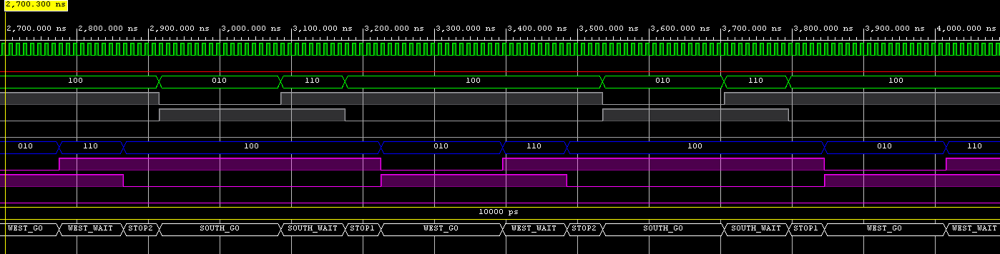
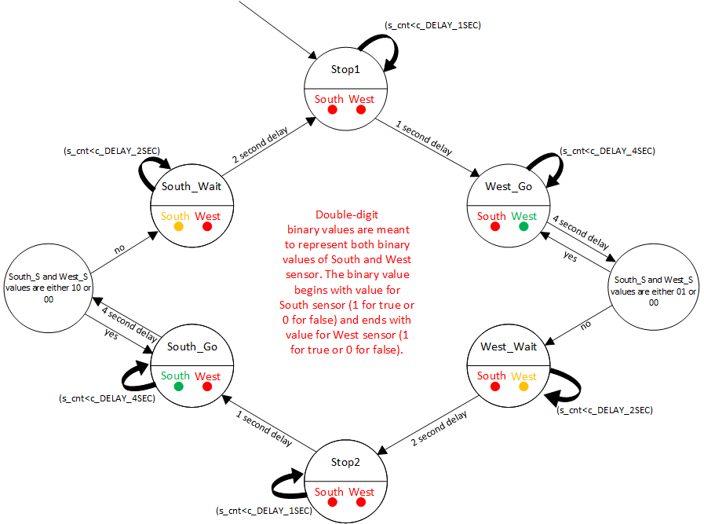

# Lab 8: Traffic light controller

## Preparation tasks 
### Completed state table,
| **Input P** | `0` | `0` | `1` | `1` | `0` | `1` | `0` | `1` | `1` | `1` | `1` | `0` | `0` | `1` | `1` | `1` |
| :-- | :-: | :-: | :-: | :-: | :-: | :-: | :-: | :-: | :-: | :-: | :-: | :-: | :-: | :-: | :-: | :-: |
| **Clock** |  |  |  |  |  |  |  |  |  |  |  |  |  |  |  |  |
| **State**    | A   | A   | B   | C   | C   | D   | A   | B   | C  | D    | B    | B    | B    | C    | D  | B  |
| **Output R** | `0` | `0` | `0` | `0` | `0` | `1` | `0` | `0` | `0`| `1`  | `0`  | `0`  | `0`  | `0`  | `1`| `0`|
### Figure with connection of RGB LEDs on Nexys A7 board and completed table with color settings.



| **RGB LED** | **Connection** |
| :-: | :-: |
| LD17 (R17) | N16 | 
| LD17 (G17) | R11 |
| LD17 (B17) | G14 |
| LD16 (R16) | N15 |
| LD16 (G16) | M16 |
| LD16 (B16) | R12|

| **RGB LED** | **Artix-7 pin names** | **Red** | **Yellow** | **Green** |
| :-:  | :-:           | :-:     | :-:        | :-:     |
| LD16 | N15, M16, R12 | `1,0,0` |  `1,1,0`   | `0,1,0` |
| LD17 | N16, R11, G14 | `1,0,0` |  `1,1,0`   | `0,1,0` |

## Traffic light controller
### State diagram

### Listing of VHDL code of sequential process `p_traffic_fsm` with syntax highlighting
```vhdl
p_traffic_fsm : process(clk)
    begin
        if rising_edge(clk) then
            if (reset = '1') then       -- Synchronous reset
                s_state <= STOP1 ;      -- Set initial state
                s_cnt   <= c_ZERO;      -- Clear all bits

            elsif (s_en = '1') then
                -- Every 250 ms, CASE checks the value of the s_state 
                -- variable and changes to the next state according 
                -- to the delay value.
                case s_state is

                    -- If the current state is STOP1, then wait 1 sec
                    -- and move to the next GO_WAIT state.
                    when STOP1 =>
                        -- Count up to c_DELAY_1SEC
                        if (s_cnt < c_DELAY_1SEC) then
                            s_cnt <= s_cnt + 1;
                        else
                            -- Move to the next state
                            s_state <= WEST_GO;
                            -- Reset local counter value
                            s_cnt   <= c_ZERO;
                        end if;

                    when WEST_GO =>
                        -- Count up to c_DELAY_4SEC
                        if (s_cnt < c_DELAY_4SEC) then
                            s_cnt <= s_cnt + 1;
                        else 
                            -- Move to the next state
                            s_state <= WEST_WAIT;
                            -- Reset local counter value 
                            s_cnt   <= c_ZERO;
                        end if;


                    when WEST_WAIT =>
                        -- Count up to c_DELAY_2SEC
                        if (s_cnt < c_DELAY_2SEC) then
                            s_cnt <= s_cnt + 1;
                        else 
                            -- Move to the next state
                            s_state <= STOP2;
                            -- Reset local counter value 
                            s_cnt   <= c_ZERO;
                        end if;


                    when STOP2 =>
                        -- Count up to c_DELAY_1SEC
                        if (s_cnt < c_DELAY_1SEC) then
                            s_cnt <= s_cnt + 1;
                        else 
                            -- Move to the next state
                            s_state <= SOUTH_GO;
                            -- Reset local counter value 
                            s_cnt   <= c_ZERO;
                        end if;
                        
                    when SOUTH_GO =>
                        -- Count up to c_DELAY_4SEC
                        if (s_cnt < c_DELAY_4SEC) then
                            s_cnt <= s_cnt + 1;
                        else 
                            -- Move to the next state
                            s_state <= SOUTH_WAIT;
                            -- Reset local counter value 
                            s_cnt   <= c_ZERO;
                        end if;
                        
                    when SOUTH_WAIT =>
                        -- Count up to c_DELAY_4SEC
                        if (s_cnt < c_DELAY_2SEC) then
                            s_cnt <= s_cnt + 1;
                        else 
                            -- Move to the next state
                            s_state <= STOP1;
                            -- Reset local counter value 
                            s_cnt   <= c_ZERO;
                        end if;
                        
                    -- It is a good programming practice to use the 
                    -- OTHERS clause, even if all CASE choices have 
                    -- been made. 
                    when others =>
                        s_state <= STOP1;

                end case;
            end if; -- Synchronous reset
        end if; -- Rising edge
    end process p_traffic_fsm;
```
### Listing of VHDL code of combinatorial process `p_output_fsm` with syntax highlighting,
```vhdl
    p_output_fsm : process(s_state)
    begin
        case s_state is
            when STOP1 =>
                south_o <= c_RED;
                west_o  <= c_RED;
            when WEST_GO =>
                south_o <= c_RED;
                west_o  <= c_GREEN;                
            when WEST_WAIT =>
                south_o <= c_RED;
                west_o  <= c_YELLOW;  
            when STOP2 =>
                south_o <= c_RED;
                west_o  <= c_RED;  
            when SOUTH_GO =>
                south_o <= c_GREEN;
                west_o  <= c_RED;  
            when SOUTH_WAIT =>
                south_o <= c_YELLOW;
                west_o  <= c_RED;  
            when others =>
                south_o <= c_RED;
                west_o  <= c_RED;
        end case;
    end process p_output_fsm;

end architecture Behavioral;
```
### Screenshot(s) of the simulation, from which it is clear that controller works correctly.







## Smart controller
### State table 
<table>
<thead>
  <tr>
    <th rowspan="2">Current state</th>
    <th colspan="2">Lights</th>
    <th colspan="4">Next state depending on input</th>
  </tr>
  <tr>
    <td>South</td>
    <td>West</td>
    <td>No Cars <br>(00)</td>
    <td>Cars To West<br>(01)</td>
    <td>Cars to South<br>(10)</td>
    <td>Cars from Both Directions <br>(11)</td>
  </tr>
</thead>
<tbody>
  <tr>
    <td>West go</td>
    <td>Red</td>
    <td>Green</td>
    <td>West Go</td>
    <td>West Go</td>
    <td>West Wait</td>
    <td>West Wait</td>
  </tr>
  <tr>
    <td>West wait</td>
    <td>Red</td>
    <td>Yellow</td>
    <td>South Go</td>
    <td>South Go</td>
    <td>South Go</td>
    <td>South Go</td>
  </tr>
  <tr>
    <td>South go</td>
    <td>Green</td>
    <td>Red</td>
    <td>South go</td>
    <td>South wait</td>
    <td>South go</td>
    <td>South wait</td>
  </tr>
  <tr>
    <td>South wait</td>
    <td>Yellow</td>
    <td>Red</td>
    <td>West go</td>
    <td>West go </td>
    <td>West go</td>
    <td>West go</td>
  </tr>
</tbody>
</table>

### State diagram



### Listing of VHDL code of sequential process `p_smart_traffic_fsm`
```vhdl
    p_smart_traffic_fsm : process(clk)
    begin
        if rising_edge(clk) then
            if (reset = '1') then       -- Synchronous reset
                s_state <= STOP1 ;      -- Set initial state
                s_cnt   <= c_ZERO;      -- Clear all bits

            elsif (s_en = '1') then
                -- Every 250 ms, CASE checks the value of the s_state 
                -- variable and changes to the next state according 
                -- to the delay value.
                case s_state is

                    -- If the current state is STOP1, then wait 1 sec
                    -- and move to the next GO_WAIT state.
                    when STOP1 =>
                        -- Count up to c_DELAY_1SEC
                        if (s_cnt < c_DELAY_1SEC) then
                            s_cnt <= s_cnt + 1;
                        else
                            -- Move to the next state
                            s_state <= WEST_GO;
                            -- Reset local counter value
                            s_cnt   <= c_ZERO;
                        end if;

                    when WEST_GO =>
                        if (s_cnt < c_DELAY_4SEC) then
                            s_cnt <= s_cnt + 1;
                        elsif((south_s = '0' and west_s = '1' ) or (west_s = '0' and south_s = '0')) then
                                s_state <= WEST_GO;
                            else
                                s_state <= WEST_WAIT; 
                            end if;
                            s_cnt   <= c_ZERO;
               
                    when WEST_WAIT =>
                        if (s_cnt < c_DELAY_2SEC) then
                            s_cnt <= s_cnt + 1;
                        else
                            s_state <= STOP2;
                            s_cnt   <= c_ZERO;
                        end if;
                        
                    when STOP2 =>
                        if (s_cnt < c_DELAY_1SEC) then
                            s_cnt <= s_cnt + 1;
                        else
                            s_state <= SOUTH_GO;
                            s_cnt   <= c_ZERO;
                        end if;
                        
                    when SOUTH_GO =>
                        if (s_cnt < c_DELAY_4SEC) then
                            s_cnt <= s_cnt + 1;
                        elsif((south_s = '1' and west_s = '0' ) or (west_s = '0' and south_s = '0')) then
                                s_state <= SOUTH_GO;
                            else
                                s_state <= SOUTH_WAIT;
                            end if;
                            s_cnt   <= c_ZERO;
                        
                    when SOUTH_WAIT =>
                        if (unsigned(s_cnt) < c_DELAY_2SEC) then
                            s_cnt <= s_cnt + 1;
                        else
                            s_state <= STOP1;
                            s_cnt   <= c_ZERO;
                        end if;

                    -- It is a good programming practice to use the 
                    -- OTHERS clause, even if all CASE choices have 
                    -- been made. 
                    when others =>
                        s_state <= STOP1;

                end case;
            end if; -- Synchronous reset
        end if; -- Rising edge
    end process p_smart_traffic_fsm;

```
